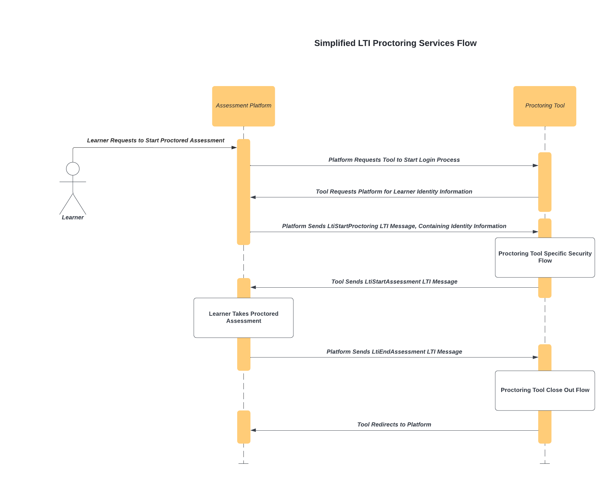
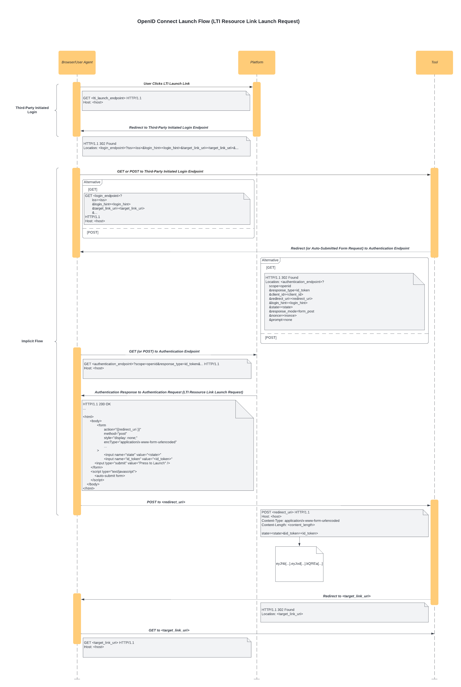

LTI for Proctoring in edx-exams Independently Deployable Application
====================================================================

The ``edx-exams`` service is an idependently deployable application (IDA). The ``edx-exams`` service provides proctoring
functionality to exams in the edX ecosystem. In order to provide proctoring in a standardized, sustainable way,
``edx-exams`` implements the `IMS Proctoring Services Specification`_ v1.0.

.. contents::

IMS Proctoring Services Specification
-------------------------------------

The `IMS Proctoring Services Specification`_ is built atop the `Learning Tools Interoperability® (LTI®) Core
Specification`_ v1.3 (LTI 1.3) and `LTI Advantage`_ services. "LTI works on the concept of a browser-based launch from a
platform into an external tool or application. For proctoring, a test delivery or assessment management system would be
the platform and the proctoring service the tool." [1]_ For the purposes of this documentation, the edX LMS will be
referred to as the Assessment Platform, and the proctoring provider will be referred to as the Proctoring Tool.

Please note that this documentation assumes general familiarity with the `Learning Tools Interoperability® (LTI®) Core
Specification`_ v1.3. The `Learning Tools Interoperability® (LTI®) Core Specification`_ v1.3 uses the `IMS Security
Framework`_, which relies on elements of the `OpenID Connect Core 1.0`_ (OIDC) and OAuth 2.0 specifications. It is not
within the scope of this documentation to comprehensively describe those specifications. Elements of those
specifications that are key to the `IMS Proctoring Services Specification`_ will be described, but please refer to those
specifications if anything is unclear.

edx-exams
---------
**TODO**: link to Zach's documentation

xblock-lti-consumer
-------------------
The `xblock-lti-consumer`_ library is edX's LTI consumer implementation. It contains a reusable implementation of an LTI
consumer, which is installed into edx-exams in order to provide an implementation of the `IMS Proctoring Services
Specification`_.

IMS Proctoring Services Specification
=====================================

Key Terms
---------

* **User Agent**: A user agent is "the client which initiates a request." [21]_ This is typically a browser.
* **LTI Message**: An LTI message is a request or a response exchanged between a Tool and a Platform.
* **LTI Link**: An LTI link is a "a reference to a specific tool stored by a platform which may, for example, lead to a
  specific resource or content hosted on the tool, depending on the message_type of the LTI Link... The LTI Link is
  presented by the platform that provides access to the content of the tool and may be used as a means of performing LTI
  launches within the context of the platform." [28]_
* **LTI Launch**: An LTI launch "refers to the process in which a user interacts with an LTI Link within the platform
  and is subsequently "launched" into a tool." [22]_
* **Authorization Server**: An authorization server is the entity that provides authorization information, "using the
  thentication information supplied to it by the client." [23]_
* **Relying Party**: A relying party is an "OAuth 2.0 client application requiring [user] authentication and claims from
  an OpenID Provider." [24]_
* **ID Token**: An ID token is an `OpenID Connect Core 1.0`_ ID token. It contains claims about authentication
  information, as well as other claims relevant to the context (e.g. LTI launch).
* **JSON Web Token (JWT)**: A JSON web token "is a compact, URL-safe means of representing claims to be transferred
  between two parties. The claims in a JWT are encoded as a JSON object that is used as the payload of a JSON Web
  Signature (JWS) structure or as the plaintext of a JSON Web Encryption (JWE) structure, enabling the claims to be
  digitally signed." [25]_
* **Claim**: A claim is "a piece of information asserted about a subject. A claim is represented as a name/value pair
  consisting of a Claim Name and a Claim Value." [25]_
* **JSON Web Signature (JWS)**: A JSON web signature "represents content secured with digital signatures or Message
  Authentication Codes (MACs) using JSON-based data structures." [26]_
* **JSON Web Key (JWK)**: A JSON web key is "a JSON object that represents a cryptographic key. The members of the
  object represent properties of the key, including its value." [27]_
* **JSON Web Key Set (JWKS)**: A JWK set is "a JSON object that represents a set of JWKs. The JSON object must have a
  "keys" member, which is an array of JWKs." [27]_
* **Issuer**: An issue is an "entity that issues a set of claims. The issuer is the entity that starts an information
  exchange and as such could be either a Platform or a [Tool]." [24]_

Flow of Information
-------------------

`LTI 1.3`_ defines a standardized specification for integration of Tools into Platforms. There are two ways in which
Platforms and Tools can communicate under `LTI 1.3`_: messages and services.

Messages
++++++++

Very simply, LTI messages refer to information contained in browser requests or responses. LTI messages are used to pass
the browser between different hosts while the browser is in use by the user. In this case, the hosts are the Assessment
Platform and the Proctoring Tool. In the `IMS Proctoring Services Specification`_, messages are exchanged in both
directions during the proctoring flow.

The structure and requirements of an LTI message depends on the context its being used or sent in. For example, we can
think of messages as either being “Platform-Originating Messages” or “Tool-Originating Messages”. Depending on the type
of the message, the requirements for sending and receiving the message will be different. This will be discussed later
in this documentation.

In the `IMS Proctoring Services Specification`_, there are three different messages that are sent. The type is defined
by a property on the message called ``https://purl.imsglobal.org/spec/lti/claim/message_type``. The three different
types of message_types are ``LtiStartProctoring``, ``LtiStartAssessment``, and ``LtiEndAssessment``. Each message
contains the claims defined in the `IMS Security Framework`_ as well as claims defined in the `LTI 1.3`_ and `IMS
Proctoring Services Specification`_.

Services
++++++++

LTI services provide ways for a Tool to communicate directly to a Platform outside the context of the browser. That
means that no user and no browser are involved. As the name implies, these services can be implemented as simple web
services.

In the `IMS Proctoring Services Specification`_, LTI services are used by the Proctoring Tool to communicate with the
Assessment Platform while a user is taking a proctored assessment or after the user has submitted a proctored
assessment.

LTI Launch
++++++++++

The concept of an LTI launch refers to the process by which a user interacts with an LTI link in the Platform, thereby
“launching” them into the Tool. The launch is accomplished by both the Platform and the Tool passing LTI messages to
each other through the browser.

An LTI launch for proctoring involves a few steps. These steps are built upon those for an `LTI resource link launch
request`_. This flow is defined in detail in the `LTI 1.3`_ specification, and it builds upon the steps in the `IMS
Security Framework`_.  The `IMS Proctoring Services Specification`_ expands on and slightly modifies the specification
for an `LTI resource link launch request`_ to fit the needs of the proctoring flow.

Before discussing the technical details of an LTI launch for proctoring, it is important to understand the general
proctoring flow.

Proctoring Flow (Basic Description)
-----------------------------------

Diagram
+++++++

Note that this diagram omits an important party in the LTI launch flow: the browser. For simplicity, this diagram shows
the flow of the user between the Assessment Platform and the Proctoring Tool.

Steps
+++++

#. The authenticated user loads the Assessment Platform in the browser.
#. The user requests to begin proctoring in the Assessment Platform in the browser.
#. The Assessment Platform directs the user's browser to send a message to the Proctoring Tool, communicating that
   proctoring should be started. In order for this message to be sent, the following steps are necessary.

   #. The Assessment Tool directs the user's browser to make a request to the Proctoring Tool, communicating to the
      Proctoring Tool that the Proctoring Tool should start the process of authenticating the user. The Proctoring Tool
      must authenticate the user by receiving user identity information from the Assessment Platform, which is the
      Identity Provider (IdP).
   #. The Proctoring Tool receives the request. It responds by directing the user's browser to make a formal
      authentication request to the Assessment Platform's authentication endpoint.
   #. The Assessment Platform receives the request. It responds by directing the user's browser to make a request to the
      Proctoring Tool, representing the authentication response. This response is the LTI launch message. The message
      includes the ``LtiStartProctoring`` ``message_type`` claim, indicating to the Proctoring Tool that the Assessment
      Platform is requesting that proctoring be started. The message also includes user identity information about the
      authenticated user.

#. The user's browser loads the Proctoring Tool. The Proctoring Tool provides an interface for the user to initiate the
   proctoring process within the Proctoring Tool, securing the user's environment and performing any necessary user
   identity verification.
#. Once the Proctoring Tool is satisfied that the user is ready to start their proctored exam, it directs the user's
   browser to make a request to the Assessment Platform. This request is an LTI message. The message includes the
   ``LtiStartAssessment`` ``message_type`` claim, indicating to the Assessment Tool that the Proctoring Tool is
   requesting that the assessment be started.
#. The user's browser loads the Assessment Platform.
#. The user begins their assessment.
#. During the assessment, the Proctoring Tool can use the LTI service to communicate directly with the Assessment
   Platform.
#. Once the assessment is completed, if the Proctoring Tool requires this step, the Assessment Platform directs the
   user's browser to make a request to the Assessment Platform. This request is an LTI message. The message includes the
   ``LtiEndAssessment`` ``message_type`` claim, indicating to the Proctoring Tool that the Assessment Platform is
   requesting that proctoring should be completed. To send this message, steps 3i-iii should be followed.
#. After the assessment, the Proctoring Tool can use the LTI service to communicate directly with the Assessment
   Platform.

Proctoring Flow (Detailed Description)
---------------------------------------

Messages
++++++++

In `LTI 1.3`_, there are two types of LTI messages: Platform-Originating messages and Tool-Originating messages. As the
names imply, Platform-Originating messages are LTI messages sent by the Platform to the Tool, and Tool-Originating
messages are LTI messages sent by the Tool to the Platform. The reason this distinction is important is because the type
of message governs how the message must be structured and exchanged.

Platform-Originating Messages
^^^^^^^^^^^^^^^^^^^^^^^^^^^^^

When Platforms act as Identity Providers (IdP), they must include user identity information in messages they send to
Tools. For this reason, the process for sending a Platform-Originating message uses portions of the `OpenID Connect
Core 1.0`_ (OIDC) specification. This process will be referred to as the `OpenID Connect Launch Flow`_. OIDC defines
processes by which Clients receive authentication information from Authorization Servers. In our case, the Client is the
Proctoring Tool, and the Authorization Server is the Assessment Platform.

Tool-Originating Messages
^^^^^^^^^^^^^^^^^^^^^^^^^

Typically, Tools do not act as Authorization Servers, so messages that Tools send to Platforms do not contain user
identity information. For this reason, the `OpenID Connect Launch Flow`_ is not used. Instead, these messages are sent
as signed JWTs via a request made by the browser.

Pre-Registration
++++++++++++++++

In order for a Platform and Tool to communicate, important information must be shared before an LTI launch occurs. This
is done during a pre-registration step. During this step, information is exchange out-of-band between the Platform and
the Tool.

Information Sent from Proctoring Tool to Assessment Platform
^^^^^^^^^^^^^^^^^^^^^^^^^^^^^^^^^^^^^^^^^^^^^^^^^^^^^^^^^^^^

+------------------------+-------------+-------------------------------------------+--------------------------------------------------------+
| Name                   | Description                                             | Notes                                                  |
|                        |                                                         |                                                        |
+========================+=========================================================+========================================================+
| OpenID Connect (OIDC)  | This value is a URL to the Proctoring Tool's            |                                                        |
| Third-Party Login      | OpenID Connect Third-Party Login Initiation Endpoint.   |                                                        |
| Initiation Endpoint    | This is what the Assessment Platform uses to start      |                                                        |
|                        | the process for sending a Platform-Originating message. |                                                        |
+------------------------+---------------------------------------------------------+--------------------------------------------------------+
| Launch Endpoint        | This value is a URL to the Proctoring Tool resource     |                                                        |
|                        | that should be displayed when the user starts proctoring|                                                        |
|                        | and the Proctoring Tool redirects the user to the       |                                                        |
|                        | Proctoring Tool interface in the browser.               |                                                        |
+------------------------+---------------------------------------------------------+--------------------------------------------------------+
| Redirect URIs          | This value is a list of URLs that the Assessment        | We do not collect this information. We do not validate |
|                        | Platform can send its authentication response to. It    | that the redirect URI sent in the authentication       |
|                        | represents the only valid redirect URIs that the        | response matches one of these pre-registered URIs.     |
|                        | Assessment Platform can use.                            | Many Tools complain or stop working if we do.          |
+------------------------+---------------------------------------------------------+--------------------------------------------------------+
| Client ID              | This value represents an OAuth 2.0 client ID.           | In our implementation, the Assessment Platform defines |
|                        | Typically, this value is defined by the Authorization   | this value and communicates it to the Proctoring Tool. |
|                        | Server, which may be owned by the Assessment Platform,  |                                                        |
|                        | and communicated to the Proctoring Tool. However,       |                                                        |
|                        | sometimes the Proctoring Tool defines and communicates  |                                                        |
|                        | this value, which is why it is included here.           |                                                        |
+------------------------+---------------------------------------------------------+--------------------------------------------------------+
| JSON Web Key (JWK) or  | This value is either the JWK representing the           |                                                        |
| JSON Web Key Set (JWKS)| Proctoring Tool's public key or a URL to the Proctoring |                                                        |
| Endpoint               | Tool's JWKS. The JWKS endpoint serves up a container of |                                                        |
|                        | one or more JWKs, identified by a key ID (``kid``).     |                                                        |
+------------------------+---------------------------------------------------------+--------------------------------------------------------+

Information Sent from Assessment Platform to Proctoring Tool
^^^^^^^^^^^^^^^^^^^^^^^^^^^^^^^^^^^^^^^^^^^^^^^^^^^^^^^^^^^^

+------------------------+-------------+-------------------------------------------+--------------------------------------------------------+
| Name                   | Description                                             | Notes                                                  |
|                        |                                                         |                                                        |
+========================+=========================================================+========================================================+
| OpenID Connect (OIDC)  | This value is a URL to the Assessment Tool's            |                                                        |
| Authorization Endpoint | Authorization endpoint. This is what the Proctoring     |                                                        |
|                        | Tool uses to make an authentication request to the      |                                                        |
|                        | Asessment Platform.                                     |                                                        |
+------------------------+---------------------------------------------------------+--------------------------------------------------------+
| Issuer Identifier      | This value identifies the issuer. An issuer is the      |                                                        |
|                        | entity that starts an information exchange. In this     |                                                        |
|                        | case, this is the Assessment Platform. "An Issuer       |                                                        |
|                        | Identifier is a case-sensitive URL, using the           |                                                        |
|                        | HTTPS scheme, that contains scheme, host, and           |                                                        |
|                        | optionally, port number, and path components, and no    |                                                        |
|                        | query or fragment components." [24]_                    |                                                        |
+------------------------+---------------------------------------------------------+--------------------------------------------------------+
| Client ID              | This value represents an OAuth 2.0 client ID.           | In our implementation, the Assessment Platform defines |
|                        | Typically, this value is defined by the Authorization   | this value and communicates it to the Proctoring Tool. |
|                        | Server, which may be owned by the Assessment Platform,  |                                                        |
|                        | and communicated to the Proctoring Tool.                |                                                        |
+------------------------+---------------------------------------------------------+--------------------------------------------------------+
| Deployment ID          | "A deployment of a tool defines the scope of contexts   |                                                        |
|                        | under which a tool is made available... When a user     |                                                        |
|                        | deploys a tool within their tool platform, the platform |                                                        |
|                        | must generate an immutable deployment_id identifier to  |                                                        |
|                        | identify the integration. A platform MUST generate a    |                                                        |
|                        | unique deployment_id for each tool it integrates with." |                                                        |
|                        | [29]_                                                   |                                                        |
+------------------------+---------------------------------------------------------+--------------------------------------------------------+
| JSON Web Key (JWK) or  | This value is either the JWK representing the           |                                                        |
| JSON Web Key Set (JWKS)| Assessment Platform's public key or a URL to the        |                                                        |
| Endpoint               | Assessment Platform's JWKS. The JWKS endpoint serves up |                                                        |
|                        | a container of one or more JWKSs, identified by a key   |                                                        |
|                        | key ID (``kid``).                                       |                                                        |
+------------------------+---------------------------------------------------------+--------------------------------------------------------+

OpenID Connect Launch Flow
++++++++++++++++++++++++++

When the Assessment Platform sends a message to the Proctoring Tool to either start proctoring or stop proctoring, it
sends a Platform-Originating message. Platform-Originating messages must follow the following `OpenID Connect Launch
Flow`_.

Authentication
^^^^^^^^^^^^^^

A critical component of a secure LTI launch is user authentication. The user must be authenticated with the Proctoring
Tool in order to access the resource - in our case, the resource is the proctoring software. The process of
authenticating the user in `LTI 1.3`_ comes from the `OpenID Connect Core 1.0`_ (OIDC) Specification. Authentication
information is exchanged between an OpenID Provider (OP) and a Relying Party (RP). The OP is the Authorization Server
and the Identity Provider (IdP). In our case, the Assessment Platform is the OP, and the Proctoring Tool is the RP.

An LTI launch performs authentication using the `OIDC Implicit Flow`_. Also, because this workflow is vulnerable to the
Login Cross-Site Request Forgery (CSRF) attacks, the `OIDC Initiating Login from a Third Party`_ flow is used as a
mitigation strategy.

Below is a summary of the `OIDC Initiating Login from a Third Party`_ and the `OIDC Implicit Flow`_ steps of the `OpenID
Connect Launch Flow`_.

Diagram
^^^^^^^

This diagram displays the `OpenID Connect Launch Flow`_, including the `OIDC Initiating Login from a Third Party`_ and
the `OIDC Implicit Flow`_ steps.

Step 1: Assessment Platform Starts Third-Party Initiated Login
^^^^^^^^^^^^^^^^^^^^^^^^^^^^^^^^^^^^^^^^^^^^^^^^^^^^^^^^^^^^^^

The first step of the `OpenID Connect Launch Flow`_ is the third-party initiated login.

The purpose of this request is for the Assessment Platform to communicate to the Proctoring Tool that the `OpenID
Connect Launch Flow`_ should begin. The request informs the Proctoring Tool that it must make the authentication request
described in `Step 2: Proctoring Tool Sends Authentication Request to Assessment Platform`_.

“Third-Party Initiated Login” refers to the fact that the OpenID Provider (OP) or another party is initiating the login
flow with the Relying Party (RP) instead of the RP initiating the login flow with the OP. It is used to mitigate Login
Cross-Site Request Forgery (CSRF) attacks.

This request can be thought of as a preflight request, and you will see this step of the flow referred to as such in the
`xblock-lti-consumer`_ library.

In this step, the user's browser session is transferred from the Assessment Platform to the Proctoring Tool. 

The Assessment Platform directs the user's browser to send either a GET or a POST request to the Proctoring Tool. The
GET request is small and might occur as part of a redirect, while the POST request is made through an auto-submitted
form. The endpoint that the request is sent to is the the Proctoring Tool's OpenID Connect (OIDC) Third-Party Login
Initiation Endpoint. This endpoint is given to the Assessment Platform by the Proctoring Tool during the out-of-band
pre-registration step: `Information Sent from Proctoring Tool to Assessment Platform`_.

Below are the parameters or form data included in the request.

+------------------------+-------------+-------------------------------------------------------------------------------+
| Name                   | Required or | Description                                                                   |
|                        | Optional    |                                                                               |
+========================+=============+===============================================================================+
| iss                    | Required    | This value identifies the issuer. An issuer is the entity that starts an      |
|                        |             | information exchange. In this case, this is the Assessment Platform.          |
+------------------------+-------------+-------------------------------------------------------------------------------+
| login_hint             | Required    | This value can be used by the Assessment Platform to provide a hint to the    |
|                        |             | authorization server about the “login identifier the … [user] might use to    |
|                        |             | to login." [2]_                                                               |
+------------------------+-------------+-------------------------------------------------------------------------------+
| target_link_uri        | Required    | This value represents the actual resource that should displayed or the        |
|                        |             | Proctoring Tool launch endpoint that should be executed against. Keep in mind |
|                        |             | that the Proctoring Tool should not use this value; it should use the one in  |
|                        |             | the LTI launch message, described in                                          |
|                        |             | `Step 3: Assessment Platform Sends Authentication                             |
|                        |             | Response to Proctoring Tool (LTI Launch Message)`_.                           |
+------------------------+-------------+-------------------------------------------------------------------------------+
| lti_message_hint       | Optional    | This value can be used to provide a hint to the Assessment Platform about what|
|                        |             | LTI message will be sent as part of this launch flow or what the nature of the|
|                        |             | LTI launch os. The value is opaque to the Proctoring Tool. The Proctoring Tool|
|                        |             | must include it in the authentication request unaltered, described in         |
|                        |             | `Step 2: Proctoring Tool Sends Authentication Request to Assessment Platform`_|
|                        |             | .                                                                             |
+------------------------+-------------+-------------------------------------------------------------------------------+
| lti_deployment_id      | Optional    | This value can be used by the Proctoring Tool to customize behavior based on a|
|                        |             | specific deployment. If the Assessment Platform includes this value, it must  |
|                        |             | be the same as the ``lti_deployment_id`` claim sent in the LTI launch message,|
|                        |             | described in `Step 3: Assessment Platform Sends Authentication                |
|                        |             | Response to Proctoring Tool (LTI Launch Message)`_.                           |
+------------------------+-------------+-------------------------------------------------------------------------------+
| client_id              | Optional    | This value "specifies the client id for the authorization server that should  |
|                        |             | be used to authorize the subsequent LTI message request. This allows for a    |
|                        |             | platform to support multiple registrations from a single issuer, without      |
|                        |             | relying on the ``initiate_login_uri`` as a key." [4]_                         |
+------------------------+-------------+-------------------------------------------------------------------------------+

Step 2: Proctoring Tool Sends Authentication Request to Assessment Platform
^^^^^^^^^^^^^^^^^^^^^^^^^^^^^^^^^^^^^^^^^^^^^^^^^^^^^^^^^^^^^^^^^^^^^^^^^^^

The second step of the `OpenID Connect Launch Flow`_ is the authentication request. 

The purpose of this request is for the Proctoring Tool to request user identity information from the Assessment Platform
in order to authenticate the user.

At this step, the user's browser session is transferred from the Proctoring Tool to the Assessment Platform. 

After the Assessment Platform directs the user's browser to make the request described in `Step 1: Assessment Platform
Starts Third-Party Initiated Login`_ to the Proctoring Tool, the Proctoring Tool must direct the user's browser to make
an authentication request to the Authorization Server. In our case, the Authorization Server is the Assessment Platform.
In the OIDC specification, the authentication request is an OAuth 2.0 Authorization Request.

The Proctoring Tool direct the browser to send either a GET or a POST request to the Authorization Server. The
Authorization Server must support both methods.

The endpoint that the request is sent to is the Assessment Platform's OIDC Authentication Endpoint. This endpoint is
given to the Proctoring Tool by the Assessment Platform during the out-of-band pre-registration step: `Information Sent
from Assessment Platform to Proctoring Tool`_.

The request includes the following query parameters in a GET request or form data in a POST request.

Below are the parameters or form data included in the request.

+------------------------+-----------+-------------+-------------------------------------------------------------------+
| Name                   | Value     | Required or | Description                                                       |
|                        |           | Optional    |                                                                   |
+========================+===========+=============+===================================================================+
| scope                  | openid    | Required    | This value must be "openid".                                      |
|                        |           |             |                                                                   |
+------------------------+-----------+-------------+-------------------------------------------------------------------+
| response_type          | id_token  | Required    | This value must be "id_token". The value refers to an `OAuth 2.0  |
|                        |           |             | Response Type`_. This value specifies what authorization          |
|                        |           |             | processing flow will be used.                                     |
+------------------------+-----------+-------------+-------------------------------------------------------------------+
| client_id              |           | Required    | This value is the OAuth 2.0 ``client_id`` assigned to the         |
|                        |           |             | Proctoring Tool. This value is exchanged during the               |
|                        |           |             | pre-registration step: `Information Sent from Assessment Platform |
|                        |           |             | to Proctoring Tool`_.                                             |
+------------------------+-----------+-------------+-------------------------------------------------------------------+
| redirect_uri           |           | Required    | This value is the endpoint that the Authorization Server must send|
|                        |           |             | its response to this request to. It must be one of th redirect    |
|                        |           |             | URIs exchanged during the pre-registration step:                  |
|                        |           |             | `Information Sent from Proctoring Tool to Assessment Platform`_.  |
|                        |           |             | We do not validate that                                           |
|                        |           |             | this value matches one of the pre-registered URIs. Many Tools     |
|                        |           |             | complain or stop working if we do.                                |
+------------------------+-----------+-------------+-------------------------------------------------------------------+
| login_hint             |           | Required    | This value is the ``login_hint`` sent in the third-party initiated|
|                        |           |             | login request from the Assessment Platform to the Proctoring Tool,|
|                        |           |             | described in `Step 1: Assessment Platform Starts Third-Party      |
|                        |           |             | Initiated Login`_. The Proctoring Tool must include it the        |
|                        |           |             | authentication request unaltered.                                 |
+------------------------+-----------+-------------+-------------------------------------------------------------------+
| state                  |           | Optional    | This value is a value that the Proctoring Tool can use as an      |
|                        |           |             | anti-CSRF token and that the Proctoring Tool can use to maintain  |
|                        |           |             | state between this request and the Assessment Platform's          |
|                        |           |             | authentication response. It is opaque to the Assessment Platform. |
|                        |           |             | The Assessment Platform must include it in the authentication     |
|                        |           |             | response unaltered, described in                                  |
|                        |           |             | `Step 3: Assessment Platform Sends Authentication                 |
|                        |           |             | Response to Proctoring Tool (LTI Launch Message)`_.               |
+------------------------+-----------+-------------+-------------------------------------------------------------------+
| response_mode          | form_post | Required    | This value must be "form_post". This value tells the Assessment   |
|                        |           |             | Platform what response mode to use when responding to this request|
|                        |           |             | Because the `ID Token`_ that will be sent by the Assessment       |
|                        |           |             | Platform, described in                                            |
|                        |           |             | `Step 3: Assessment Platform Sends Authentication                 |
|                        |           |             | Response to Proctoring Tool (LTI Launch Message)`_,               |
|                        |           |             | may be large, it should be sent via a form POST.                  |
+------------------------+-----------+-------------+-------------------------------------------------------------------+
| nonce                  |           | Required    | This value is used to mitigate replay attacks. It associates the  |
|                        |           |             | Proctoring Tool's session with the `ID Token`_ that will be sent  |
|                        |           |             | by the Assessment Platform, described in                          |
|                        |           |             | `Step 3: Assessment Platform Sends Authentication                 |
|                        |           |             | Response to Proctoring Tool (LTI Launch Message)`_,               |
|                        |           |             | in response to the authentication                                 |
|                        |           |             | request. The Assessment Platform must include it in the           |
|                        |           |             | authentication response unaltered, described in                   |
|                        |           |             | `Step 3: Assessment Platform Sends Authentication                 |
|                        |           |             | Response to Proctoring Tool (LTI Launch Message)`_,               |
+------------------------+-----------+-------------+-------------------------------------------------------------------+
| prompt                 | none      | Required    | This value must be "none". This value represents whether the      |
|                        |           |             | Assessment Platform should prompt the user to reauthenticate      |
|                        |           |             | and/or provide consent. Because the user should already be        |
|                        |           |             | authenticated with the Assessment Platform, there is no need to   |
|                        |           |             | require reauthentication or consent.                              |
+------------------------+-----------+-------------+-------------------------------------------------------------------+

Step 3: Assessment Platform Sends Authentication Response to Proctoring Tool (LTI Launch Message)
^^^^^^^^^^^^^^^^^^^^^^^^^^^^^^^^^^^^^^^^^^^^^^^^^^^^^^^^^^^^^^^^^^^^^^^^^^^^^^^^^^^^^^^^^^^^^^^^^

The third step of the `OpenID Connect Launch Flow`_ is the Assessment Platform's response to the Proctoring Tool's
authentication request, described in `Step 2: Proctoring Tool Sends Authentication Request to Assessment Platform`_.
This is referred to as the authentication response.

The information contained in this response is considered the actual LTI launch message. The previous steps are necessary
steps in ensuring that the information is exchanged securely.

At this step, the user's browser session is transferred from the Assessment Platform to the Proctoring Tool.

When the Assessment Plaform receives the authentication request from the Proctoring Tool, it must perform a number of
actions. It must verify that the ``redirect_uri`` value is a valid endpoint registered with the Proctoring Tool, as
identified by the ``client_id``. The set of valid ``redirect_uris`` was exchanged during the pre-registration step:
`Information Sent from Proctoring Tool to Assessment Platform`_. Keep in mind that in our implementation in
xblock-lti-consumer, we do not do this. It must also verify that the currently authenticated user matches the
``login_hint`` value.

According to the `OpenID Connect Core 1.0`_ specification, identity and authentication information must be communicated
using an `ID Token`_. An `ID Token`_ is OIDC's extension of OAuth 2.0. The `ID Token`_ is a JSON Web Token (JWT). The
`ID Token`_ is signed using a JSON Web Signature (JWS). The Assessment Platform signs the JWT using public-key
cryptography, and the Assessment Platform generates and maintains the public key and private key pair. The JWT is signed
using the Assessment Platform's private key. The Assessment Platform's public key, represented as a JSON Web Key (JWK),
or a URL to the Assessment Platform's JSON Web Key Set (JWKS), is exchanged during the pre-registration step:
`Information Sent from Assessment Platform to Proctoring Tool`_. The Proctoring Tool uses the JWK or the JWKS to verify
the signature. The JWT is not encrypted.

The Assessment Platform directs the user's browser to make a POST request to the Proctoring Tool with two form
parameters: ``state`` and ``id_token``. ``state`` is the same state value in the Proctoring Tool's authentication
request; it must be included unaltered. ``id_token`` is the `ID Token`_ described above. This POST request is send with
an auto-submitted form. Recall that the ``response_mode`` value is "form_post", which requires a form POST. The
Assessment Platform's response must be sent to the ``redirect_uri`` value from the Proctoring Tool's authentication
request.

In the proctoring flow, there are two different kinds of LTI launch messages that can be sent by the Assessment Platform
as Platform-Originating messages, defined by the message_type claim: ``LtiStartProctoring`` and ``LtiEndAssessment``.
The type of the message_type claim governs what additional proctoring related claims are necessary in the `ID Token`_.
The base claims necessary in the `ID Token`_ are described by the `IMS Security Framework` and  the LTI resource link
launch request of `LTI 1.3`.

Below are the claims included in the `ID Token`_.

Core User Identity Claims from IMS Security Framework
*****************************************************

Note that, typically, many more of these claims are required. However, the `IMS Proctoring Services Specification`
requires only the ``iss`` and ``sub`` claims, which is what is reflected in the ``Required or Optional`` column here.

+------------------------+-------------+-------------------------------------------------------------------------------+
| Name                   | Required or | Description                                                                   |
|                        | Optional    |                                                                               |
+========================+=============+===============================================================================+
| iss                    | Required    | ``iss`` stands for issuer. This value identifies the issuer. An issuer is the |
|                        |             | entity that starts an information exchange. In this case, this is the         |
|                        |             | Assessment Platform.                                                          |
+------------------------+-------------+-------------------------------------------------------------------------------+
| sub                    | Required    | ``sub`` stands for subject identifier. It is a "locally unique and never-     |
|                        |             | reassigned identifier within the Issuer for the end user." [5]_ It must be the|
|                        |             | same as the Assessment Platform's ID for the user.                            |
+------------------------+-------------+-------------------------------------------------------------------------------+
| aud                    | Optional    | ``aud`` stands for audience. This value identifies what entity or entities    |
|                        |             | this `ID Token`_ is intended for. In this case, the audience is the Proctoring|
|                        |             | Tool. ``aud`` is the ``client_id`` for the Proctoring Tool.                   |
+------------------------+-------------+-------------------------------------------------------------------------------+
| exp                    | Optional    | ``exp`` stands for expiration. It is the time on or after which the           |
|                        |             | `ID Token`_ expires and after which the Proctoring Tool cannot accept it.     |
+------------------------+-------------+-------------------------------------------------------------------------------+
| iat                    | Optional    | ``iat`` stands for issued at. It is the time at which the issuer generated the|
|                        |             | `ID Token`_.                                                                  |
+------------------------+-------------+-------------------------------------------------------------------------------+
| nonce                  | Optional    | This value is the ``nonce`` sent in the authentication request from the       |
|                        |             | Proctoring Tool to the Assessment Platform, described in                      |
|                        |             | `Step 2: Proctoring Tool Sends Authentication Request to Assessment Platform`_|
|                        |             | The Assessment Platform must include it the authentication response unaltered.|
+------------------------+-------------+-------------------------------------------------------------------------------+
| azp                    | Optional    | ``azp`` stands for authorized party. It is the OAuth 2.0 ``client_id`` for the|
|                        |             | Proctoring Tool. It represents the party that the `ID Token`_ is issued to.   |
|                        |             | It's necessary when the `ID Token`_ contains a single ``aud`` value, and the  |
|                        |             | audience is different than the authorized party.                              |
+------------------------+-------------+-------------------------------------------------------------------------------+
| given_name             | Optional,   | This value is the authenticated user's given or first name(s).                |
|                        | Recommended |                                                                               |
+------------------------+-------------+-------------------------------------------------------------------------------+
| family_name            | Optional,   | This value is the authenticated user's surname or last name(s).               |
|                        | Recommended |                                                                               |
+------------------------+-------------+-------------------------------------------------------------------------------+
| name                   | Optional,   | This value is the authenticated user's full name.                             |
|                        | Recommended |                                                                               |
+------------------------+-------------+-------------------------------------------------------------------------------+
| email                  | Optional    | This value is the authenticated user's email address. The Proctoring Tool     |
|                        |             | should ignore this value unless ``email_verified`` is provided and is true.   |
+------------------------+-------------+-------------------------------------------------------------------------------+
| email_verified         | Optional    | This value represents "whether or not the Assessment Platform has verified    |
|                        |             | the [authenticated user's] email address." [5]_                               |
+------------------------+-------------+-------------------------------------------------------------------------------+
| picture                | Optional    | This value is an image file. The image is a profile photo of the authenticated|
|                        |             | user. It should not be a photo provided by the authenticated user. The        |
|                        |             | Proctoring Tool should not use this for identity verification unless          |
|                        |             | otherwise agreed to with the Assessment Platform.                             |
+------------------------+-------------+-------------------------------------------------------------------------------+
| locale                 | Optional    | This value represents the authenticated user's locale. The Assesment Platform |
|                        |             | should "use the locale attributed (sic) defined in the launch presentation    |
|                        |             | claim to indicate the candidate's preferred locale instead of this            |
|                        |             | attribute." [5]_                                                              |
+------------------------+-------------+-------------------------------------------------------------------------------+
| additional claims      | Optional    | In the OAuth 2.0 specification, there are a number of "Standard Claims" that  |
|                        |             | can additionally be included in this `ID Token`_. In order to limit exposure  |
|                        |             | of personally-identifiable information (PII), it's recommended to only        |
|                        |             | include additional user identity claims if required by the Proctoring Tool    |
|                        |             | for user identity verification.                                               |
+------------------------+-------------+-------------------------------------------------------------------------------+

Additional Proctoring Claims
****************************

+------------------------+-----------+-------------+-------------------------------------------------------------------+
| Name                   | Value     | Required or | Description                                                       |
|                        |           | Optional    |                                                                   |
+========================+===========+=============+===================================================================+
| ``https://purl.ims     | LtiStart  | Required    | This value must be "LtiStartProctoring". This value represents the|
| global.org/spec/lti/   | Proctoring|             | type of LTI launch message.                                       |
| claim/message_type``   |           |             |                                                                   |
+------------------------+-----------+-------------+-------------------------------------------------------------------+
| ``https://purl.ims     | 1.3.0     | Required    | This value must be "1.3.0". This value represents the version of  |
| global.org/spec/lti/   |           |             | the specification of LTI that the LTI message conforms to.        |
| claim/version``        |           |             |                                                                   |
+------------------------+-----------+-------------+-------------------------------------------------------------------+
| ``https://purl.ims     |           | Required    | This value represents the "platform-tool integration governing the|
| global.org/spec/lti/   |           |             | message." [6]_                                                    |
| claim/deployment_id``  |           |             |                                                                   |
+------------------------+-----------+-------------+-------------------------------------------------------------------+
| ``https://purl.ims     |           | Required    | This value represents the actual resource that should be displayed|
| global.org/spec/lti/   |           |             | or the Proctoring Tool launch endpoint that should be executed    |
| claim/target_link_uri``|           |             | against. This value must be the same as the ``target_link_uri`` as|
|                        |           |             | the ``target_link_uri`` claim sent in the third-party initiated   |
|                        |           |             | login request sent in                                             |
|                        |           |             | `Step 1: Assessment Platform Starts Third-Party Initiated Login`_.|
|                        |           |             | The Proctoring Tool should use this claim when redirecting the    |
|                        |           |             | user's browser to the final destination within the Proctoring Tool|
|                        |           |             | instead of the one in                                             |
|                        |           |             | `Step 1: Assessment Platform Starts Third-Party Initiated Login`_.|
|                        |           |             | This is because the request in                                    |
|                        |           |             | `Step 1: Assessment Platform Starts Third-Party Initiated Login`_.|
|                        |           |             | is unsigned.                                                      |
+------------------------+-----------+-------------+-------------------------------------------------------------------+
| ``https://purl.ims     |           | Required    | This "claim composes properties for the resource link from which  |
| global.org/spec/lti/   |           |             | the [launch] message occurs." [7]_ In other words, this represents|
| claim/resource_link``  |           |             | the assessment within the Assesment Platform and allows the       |
|                        |           |             | Proctoring Tool to identify different messages as pertaining to   |
|                        |           |             | the same assessment. It is a JSON object, so it will be described |
|                        |           |             | in greater detail below in                                        |
|                        |           |             | `Resource Link Claim`_.                                           |
+------------------------+-----------+-------------+-------------------------------------------------------------------+
| ``https://purl.ims     |           | Required    | This claim represents the user's attempt number in the assessment,|
| global.org/spec/lti-ap/|           |             | represented by the ``resource_link`` claim. This claim should be  |
| claim/attempt_number`` |           |             | an integer value starting at 1.                                   |
+------------------------+-----------+-------------+-------------------------------------------------------------------+
| ``https://purl.ims     |           | Required    | This claim is an array of URI values representing "roles that the |
| global.org/spec/lti/   |           |             | user has within the message's associate context." [8]_ It may be  |
| claim/roles``          |           |             | an empty array. If the array is not empty, it should include      |
|                        |           |             | ``http://purl.imsglobal.org/vocab/lis/v2/membership#Learner``. The|
|                        |           |             | Proctoring Tool must ignore this claim.                           |
+------------------------+-----------+-------------+-------------------------------------------------------------------+
| ``https://purl.ims     |           | Required    | This claim represents the Assessment Platform endpoint that the   |
| global.org/spec/lti-ap/|           |             | Proctoring Tool should redirect the user's browser to when the    |
| claim/start_assessment |           |             | Proctoring Tool has secured the user's environment and performed  |
| _url``                 |           |             | any necessary user identity verification. The                     |
|                        |           |             | ``LtiStartAssessment`` message, described in                      |
|                        |           |             | `Step 4: Proctoring Tool Receives Authentication Response and     |
|                        |           |             | Starts Proctoring Set Up`_,                                       |
|                        |           |             | is sent here.                                                     |
+------------------------+-----------+-------------+-------------------------------------------------------------------+
| ``https://purl.ims     |           | Required    | This claim represents an anti-CSRF token. The Assessment Platform |
| global.org/spec/lti-ap/|           |             | generates this token, which must be appropriate for us as an anti-|
| claim/session_data``   |           |             | CSRF token. The value is opaque to the Proctoring Tool. The       |
|                        |           |             | Proctoring Tool must include this claim in the LTI launch message,|
|                        |           |             | described in                                                      |
|                        |           |             | `Step 4: Proctoring Tool Receives Authentication Response and     |
|                        |           |             | Starts Proctoring Set Up`_,                                       |
|                        |           |             | unaltered.                                                        |
+------------------------+-----------+-------------+-------------------------------------------------------------------+
| ``https://purl.ims     |           | Optional    | This "claim composes properties for the context from within which |
| global.org/spec/lti/   |           |             | the resource link launch occurs." [9]_ It is a JSON object, so it |
| claim/context``        |           |             | will be described in greater detail below in                      |
|                        |           |             | `Context Claim`_.                                                 |
+------------------------+-----------+-------------+-------------------------------------------------------------------+
| ``https://purl.ims     |           | Optional    | This "claim composes properties associated with the platform      |
| global.org/spec/lti/   |           |             | instance initiating the launch." [10]_ It is a JSON object, so it |
| claim/tool_platform``  |           |             | will be described in greater detail below in                      |
|                        |           |             | `Platform Instance Claim`_.                                       |
+------------------------+-----------+-------------+-------------------------------------------------------------------+
| ``https://purl.ims     |           | Optional    | This "claim composes properties that describe aspect of how the   |
| global.org/spec/lti/   |           |             | message sender expects to host the presentation of the message    |
| claim/launch           |           |             | receiver's user experience." [11]_ It is a JSON object, so it will|
| _presentation``        |           |             | be described in greater detail below. The Assessment Platform     |
|                        |           |             | should provider the ``return_url`` key in this claim to specify   |
|                        |           |             | the Assessment Platform endpoint the Proctoring Tool should use if|
|                        |           |             | it must reject a user's request to start proctoring in            |
|                        |           |             | `Launch Presentation Claim`_.                                     |
+------------------------+-----------+-------------+-------------------------------------------------------------------+
| ``https://purl.ims     |           | Optional    | ``lis`` stands for Learning Information Services. This "claim     |
| global.org/spec/lti/   |           |             | composes properties that correspond to value otherwise obtainable |
| claim/lis``            |           |             | from a Learning Information Services (LIS) endpoint." [12]_ It is |
|                        |           |             | a JSON object. As it is not recommended to use this claim in      |
|                        |           |             | conjunction with proctoring, no further documentation is provided |
|                        |           |             | here.                                                             |
+------------------------+-----------+-------------+-------------------------------------------------------------------+
| ``https://purl.ims     |           | Optional    | ``acs`` stands for Assessment Control Service. This composes      |
| global.org/spec/lti-ap/|           |             | information about the optional Assessment Control Service. It is a|
| claim/acs``            |           |             | JSON object, so it will be described in greater detail below in   |
|                        |           |             | `ACS Claim`_.                                                     |
+------------------------+-----------+-------------+-------------------------------------------------------------------+
| ``https://purl.ims     |           | Optional    | This claim represents additional proctoring settings. It is a JSON|
| global.org/spec/lti-ap/|           |             | object, so it will be described in greater detail below in        |
| claim/proctoring       |           |             | `Proctoring Settings Claim`_.                                     |
| _settings``            |           |             |                                                                   |
+------------------------+-----------+-------------+-------------------------------------------------------------------+

Resource Link Claim
*******************
+------------------------+-------------+-------------------------------------------------------------------------------+
| Name                   | Required or | Description                                                                   |
|                        | Optional    |                                                                               |
+========================+=============+===============================================================================+
| id                     | Required    | This value represents an "opaque identifier for a placement of an LTI         |
|                        |             | resource link within a context that [must] be a (sic) stable and locally      |
|                        |             | unique to the ``deployment_id``. This value [must] change if the link is      |
|                        |             | copied or exported from one system or context and imported into another system|
|                        |             | or context." [13]_                                                            |
+------------------------+-------------+-------------------------------------------------------------------------------+
| description            | Optional,   | This value represents a "descriptive phrase for an LTI resource link          |
|                        | Strongly    | placement." [13]_                                                             |
|                        | Recommended |                                                                               |
+------------------------+-------------+-------------------------------------------------------------------------------+
| title                  | Optional,   | This value represents a "descriptive title for an LTI resource link           |
|                        | Strongly    | placement." [13]_                                                             |
|                        | Recommended |                                                                               |
+------------------------+-------------+-------------------------------------------------------------------------------+

Context Claim
*************

+------------------------+-------------+-------------------------------------------------------------------------------+
| Name                   | Required or | Description                                                                   |
|                        | Optional    |                                                                               |
+========================+=============+===============================================================================+
| id                     | Required    | This value represents a "stable identifier that uniquely identifies the       |
|                        |             | context from which the LTI message initiates. The context id [must] be locally|
|                        |             | unique to ``deployment_id``. It is recommended to also be locally unique to   |
|                        |             | ``iss``." [14]_                                                               |
+------------------------+-------------+-------------------------------------------------------------------------------+
| type                   | Optional    | This value represents "an array of URI values for context types. If present,  |
|                        |             | the array [must] include at least one context from the context type           |
|                        |             | vocabulary defined in `context type vocabulary                                |
|                        |             | <https://www.imsglobal.org/spec/lti/v1p3/#context-type-vocabulary>`_."       |
|                        |             | [14]_                                                                         |
+------------------------+-------------+-------------------------------------------------------------------------------+
| label                  | Optional    | This value represents a "short descriptive name for the context." [14]_       |
|                        |             | This usually contains the course ID.                                          |
+------------------------+-------------+-------------------------------------------------------------------------------+
| title                  | Optional    | This value represents a "full descriptive name for the context." [14]_        |
|                        |             | This usually contains the course name or course title.                        |
+------------------------+-------------+-------------------------------------------------------------------------------+

Platform Instance Claim
***********************

+------------------------+-------------+-------------------------------------------------------------------------------+
| Name                   | Required or | Description                                                                   |
|                        | Optional    |                                                                               |
+========================+=============+===============================================================================+
| guid                   | Required    | This value represents "a stable locally unique [value] to the ``iss``         |
|                        |             | identifier for an instance of the tool platform." [15]_                       |
+------------------------+-------------+-------------------------------------------------------------------------------+
| contact_email          | Optional    | This value represents "an administrative contact email for the platform       |
|                        |             | instance." [15]_                                                              |
+------------------------+-------------+-------------------------------------------------------------------------------+
| description            | Optional    | This value represents a "descriptive phrase for the platform instance."       |
|                        |             | [15]_                                                                         |
+------------------------+-------------+-------------------------------------------------------------------------------+
| name                   | Optional    | This value represents a "name for the platform instance."                     |
|                        |             | [15]_                                                                         |
+------------------------+-------------+-------------------------------------------------------------------------------+
| url                    | Optional    | This value represents a "home HTPS URL endpoint for the platform              |
|                        |             | instance." [15]_                                                              |
+------------------------+-------------+-------------------------------------------------------------------------------+
| product_family_code    | Optional    | This value represents a "vendor product family code for the type of           |
|                        |             | platform." [15]_                                                              |
+------------------------+-------------+-------------------------------------------------------------------------------+
| version                | Optional    | This value represents a "vendor product version for the platform."            |
|                        |             | [15]_                                                                         |
+------------------------+-------------+-------------------------------------------------------------------------------+

Launch Presentation Claim
*************************

+------------------------+-------------+-------------------------------------------------------------------------------+
| Name                   | Required or | Description                                                                   |
|                        | Optional    |                                                                               |
+========================+=============+===============================================================================+
| document_target        | Optional    | This value represents the "kind of browser window or frame from which the     |
|                        |             | user launched inside the message sender's system. The value for this          |
|                        |             | property [must] be one of ``frame``, ``iframe``, or ``window``."              |
|                        |             | [16]_                                                                         |
+------------------------+-------------+-------------------------------------------------------------------------------+
| height, width          | Optional    | These values represent the "height and width of the window or frame where the |
|                        |             | content from the message receiver will be displayed to the user."             |
|                        |             | [16]_                                                                         |
+------------------------+-------------+-------------------------------------------------------------------------------+
| return_url             | Optional    | This value represents the "fully qualified HTTPS URL within the message       |
|                        |             | sender's user experience to where the message receiver can direct the user    |
|                        |             | back. The message receiver can redirect to this URL after the user has        |
|                        |             | finished [the] activity, or if the receiver cannot start because of some      |
|                        |             | technical difficulty." [16]_ The Assesment Platform can                       |
|                        |             | provide this value to the Proctoring Tool to communicate where the user       |
|                        |             | should be redirected in the event they cannot set up their proctoring         |
|                        |             | environment. The ``return_url`` must support four query parameters, as        |
|                        |             | described in `Return URL Value of Launch Presentation Claim`_.                |
+------------------------+-------------+-------------------------------------------------------------------------------+
| locale                 | Optional    | This value represents the "language, county, and variant as represented       |
|                        |             | using the IETF Best Practices for Tags for Identifying Languages."            |
|                        |             | [16]_                                                                         |
+------------------------+-------------+-------------------------------------------------------------------------------+

Return URL Value of Launch Presentation Claim
*********************************************

The ``return_url`` of the launch presentation claim must support the following four query parameters.

+------------------------+---------------------------------------------------------------------------------------------+
| Name                   | Description                                                                                 |
|                        |                                                                                             |
+========================+=============================================================================================+
| lti_errormsg,          | These values represent "user-targeted message[s] for unsuccessful or successful             |
| lti_msg                | (respectively) activity completion. These are intended for showing to the user."            |
|                        | [16]_                                                                                       |
+------------------------+---------------------------------------------------------------------------------------------+
| lti_errorlog,          | These values represent "log-targeted message[s] for unsuccessful or successful              |
| lti_log                | (respectively) activity completion. These are intended for writing to logs."                |
|                        | [16]_                                                                                       |
+------------------------+---------------------------------------------------------------------------------------------+

ACS Claim
*********

+------------------------+-------------+-------------------------------------------------------------------------------+
| Name                   | Required or | Description                                                                   |
|                        | Optional    |                                                                               |
+========================+=============+===============================================================================+
| assessment_control     | Required    | This value represents "the URL of the Assessment Control Service endpoint."   |
| _url                   |             | [17]_                                                                         |
+------------------------+-------------+-------------------------------------------------------------------------------+
| actions                | Required    | This value represents "an array of actions supported by the service. An array |
|                        |             | of values as defined by the ``action`` parameter of the service request       |
|                        |             | object," [17]_ as described in **TODO**: link to Assessment Control Service   |
|                        |             | documentation.                                                                |
+------------------------+-------------+-------------------------------------------------------------------------------+

Proctoring Settings Claim
*************************

+------------------------+-------------+-------------------------------------------------------------------------------+
| Name                   | Required or | Description                                                                   |
|                        | Optional    |                                                                               |
+========================+=============+===============================================================================+
| data                   | Optional    | This value represents "an opaque value which is tool-specific and can be      |
|                        |             | interpreted as controlling settings not defined elsewhere."                   |
|                        |             | [18]_                                                                         |
+------------------------+-------------+-------------------------------------------------------------------------------+

Step 4: Proctoring Tool Receives Authentication Response and Starts Proctoring Set Up
^^^^^^^^^^^^^^^^^^^^^^^^^^^^^^^^^^^^^^^^^^^^^^^^^^^^^^^^^^^^^^^^^^^^^^^^^^^^^^^^^^^^^

The fourth step of the `OpenID Connect Launch Flow`_ is Proctoring Tool's response to the Assessment Platform's
authentication response, described in `Step 3: Assessment Platform Sends Authentication Response to Proctoring Tool (LTI
Launch Message)`_. This represents the end of the OpenID Connect Launch Flow.

At this step, the Proctoring Tool knows that the user intends to start proctoring. The Proctoring Tool has user identity
and authentication information about the user from the Authorization Server.

At this step, the Proctoring Tool provides the user with an interface to secure their environment and perform any
necessary user identity verification. Once the Proctoring Tool is satisfied, it must send a message to the Assessment
Platform to redirect the user back to the assessment and to communicate to the Assessment Platform that the proctored
assessment can begin, as described in `Step 5: Proctoring Tool Sends LtiStartAssessment Message to Assessment
Platform`_.

Remainder of Proctoring Flow
++++++++++++++++++++++++++++

Below is a summary of the of the entire proctoring flow, including the ``LtiStartAssessment`` and ``LtiEndAssessment``
LTI messages, which have not yet been described. The `OIDC Initiating Login from a Third Party`_ and the `OIDC Implicit
Flow`_ steps of the `OpenID Connect Launch Flow`_ are used to send the aforementioned ``LtiStartProctoring`` LTI message
and the ``LtiEndAssessment`` LTI message. These steps are abridged in this diagram.

Diagram
^^^^^^^

This diagram shows the entire proctoring flow.

.. image:: images/LTI-Proctoring-Flow.png

Step 5: Proctoring Tool Sends LtiStartAssessment Message to Assessment Platform
^^^^^^^^^^^^^^^^^^^^^^^^^^^^^^^^^^^^^^^^^^^^^^^^^^^^^^^^^^^^^^^^^^^^^^^^^^^^^^^

The fifth step of the proctoring flow is the Proctoring Tool's redirection to the Assessment Platform, communicating
that the user is ready to start the proctored assessment.

Once the Proctoring Tool is satisfied that the user has secured their environment and performed any necessary user
identity verification, it must send a message to the Assessment Platform to redirect the user back to the assessment and
to communicate to the Assessment Platform that the proctored assessment can begin.

In this step, the user's browser session is transferred from the Proctoring Tool to the Assessment Platform. 

Because this LTI message is being sent from the Proctoring Tool to the Assessment Platform, it is a Tool-Originating
message. This means that the `OpenID Connect Launch Flow`_ is not used. The LTI message is represented by a signed JWT;
it is not an `ID Token`_. The JWT signed using a JSON Web Signature (JWS). The Proctoring Tool signs the JWT using
public-key cryptography, and the Proctoring Tool generates and maintains the public key and private key pair. The JWT is
signed using the Proctoring Tool's private key. The Proctoring Tool's public key, represented by a JSON Web Key (JWK),
or a URL to the Proctoring Tool's JSON Web Key Set (JWKS), is exchanged during the pre-registration step: `Information
Sent from Proctoring Tool to Assessment Platform`_. The Assessment Platform uses the JWK or the JWKS to verify the
signature. The JWT is not encrypted.

The Proctoring Tool directs the user's browser to make a POST request to the Assessment Platform. The only required form
parameter is ``JWT``, and it includes the JWT.

Below are the claims included in the JWT.

+------------------------+-----------+-------------+-------------------------------------------------------------------+
| Name                   | Value     | Required or | Description                                                       |
|                        |           | Optional    |                                                                   |
+========================+===========+=============+===================================================================+
| ``https://purl.ims     | LtiStart  | Required    | This value must be "LtiStartAssessment". This value represents the|
| global.org/spec/lti/   | Assessment|             | type of LTI launch message.                                       |
| claim/message_type``   |           |             |                                                                   |
+------------------------+-----------+-------------+-------------------------------------------------------------------+
| ``https://purl.ims     | 1.3.0     | Required    | This value must be "1.3.0". This value represents the version of  |
| global.org/spec/lti/   |           |             | the specification of LTI that the LTI message conforms to.        |
| claim/version``        |           |             |                                                                   |
+------------------------+-----------+-------------+-------------------------------------------------------------------+
| ``https://purl.ims     |           | Required    | This value represents the "platform-tool integration governing the|
| global.org/spec/lti/   |           |             | message." [6]_                                                    |
| claim/deployment_id``  |           |             |                                                                   |
+------------------------+-----------+-------------+-------------------------------------------------------------------+
| ``https://purl.ims     |           | Required    | This claim is the ``session_data`` claim sent in the              |
| global.org/spec/lti-ap/|           |             | the ``LtiStartProctoring`` message, described in                  |
| claim/session_data``   |           |             | `Step 3: Assessment Platform Sends Authentication                 |
|                        |           |             | Response to Proctoring Tool (LTI Launch Message)`_.               |
|                        |           |             | The Proctoring Tool must include this claim unaltered.            |
+------------------------+-----------+-------------+-------------------------------------------------------------------+
| ``https://purl.ims     |           | Required    | This claim is the ``resource_link`` claim sent in the             |
| global.org/spec/lti/   |           |             | the ``LtiStartProctoring`` message, described in                  |
| claim/resource_link``  |           |             | `Step 3: Assessment Platform Sends Authentication                 |
|                        |           |             | Response to Proctoring Tool (LTI Launch Message)`_.               |
|                        |           |             | The Proctoring Tool must include this                             |
|                        |           |             | claim unaltered.                                                  |
+------------------------+-----------+-------------+-------------------------------------------------------------------+
| ``https://purl.ims     |           | Required    | This claim is the ``attempt_number`` claim sent in the            |
| global.org/spec/lti-ap/|           |             | the ``LtiStartProctoring`` message, described in                  |
| claim/attempt_number`` |           |             | `Step 3: Assessment Platform Sends Authentication                 |
|                        |           |             | Response to Proctoring Tool (LTI Launch Message)`_.               |
|                        |           |             | The Proctoring Tool must include this                             |
|                        |           |             | claim unaltered.                                                  |
+------------------------+-----------+-------------+-------------------------------------------------------------------+
| ``https://purl.ims     |           | Optional    | This claim represents whether the Assessment Platform should send |
| global.org/spec/lti-ap/|           |             | a ``LtiEndAssessment`` message to the Proctoring Tool once the    |
| claim/end_assessment   |           |             | assessment has been submitted. The value is a boolean, if it is   |
| _return``              |           |             | provided. An absent value or a value of false means the           |
|                        |           |             | Assessment Platform will not send an ``LtiEndAssessment`` message |
|                        |           |             | as part of its proctoring flow.                                   |
+------------------------+-----------+-------------+-------------------------------------------------------------------+
| ``https://purl.ims     |           | Optional    | This claim composes the user identity claims that were verified   |
| global.org/spec/lti-ap/|           |             | by the Proctoring Tool as part of its identity verification       |
| claim/verified_user``  |           |             | process, if it has one. It represents only the user identity      |
|                        |           |             | claims that were provided by the Assessment platform in the       |
|                        |           |             | ``LtiStartProctoring`` message, described in `Step 3:             |
|                        |           |             | Assessment Platform Sends Authentication                          |
|                        |           |             | Response to Proctoring Tool (LTI Launch Message)`_,               |
|                        |           |             | and then verified by the tool in some                             |
|                        |           |             | form; ``picture`` is the one exception. It is a JSON object. The  |
|                        |           |             | name-value pairs are the user identity claims define in the       |
|                        |           |             | `IMS Security Framework`_. There are a few exceptions. ``iss`` and|
|                        |           |             | ``sub`` should not be included. If ``picture`` is provided, it    |
|                        |           |             | must refer to a picture taken by the Proctoring Tool and must not |
|                        |           |             | be the same as the ``picture`` in the ``LtiStartProctoring``      |
|                        |           |             | message, described in `Step 3: Assessment Platform Sends          |
|                        |           |             | Authentication Response to Proctoring Tool (LTI Launch Message)`_.|
+------------------------+-----------+-------------+-------------------------------------------------------------------+

Step 6: Assessment Platform Receives LtiStartAssessment Message from Proctoring Tool; User Starts Proctored Assessment 
^^^^^^^^^^^^^^^^^^^^^^^^^^^^^^^^^^^^^^^^^^^^^^^^^^^^^^^^^^^^^^^^^^^^^^^^^^^^^^^^^^^^^^^^^^^^^^^^^^^^^^^^^^^^^^^^^^^^^^

The sixth step of the proctoring flow is the Assessment Platform's response to the Proctoring Tool's LtiStartAssessment
message, described in `Step 5: Proctoring Tool Sends LtiStartAssessment Message to Assessment Platform`_.

At this step, the user's browser is redirected to the Assessment Platform, and the Assessment Platform receives the
``LtiStartAssessment`` message.

The Assessment Platform then allows the user to start the assessment.

Step 7: User Submits Proctored Assessment; Assessment Platform Sends LtiEndAssessment Message if Requested
^^^^^^^^^^^^^^^^^^^^^^^^^^^^^^^^^^^^^^^^^^^^^^^^^^^^^^^^^^^^^^^^^^^^^^^^^^^^^^^^^^^^^^^^^^^^^^^^^^^^^^^^^^

The sixth step of the proctoring flow only occurs if the ``end_assessment_return`` claim in the ``LtiStartAssessment``
message, described in `Step 3: Assessment Platform Sends Authentication Response to Proctoring Tool (LTI Launch
Message)`_, from the Proctoring Tool to the Assessment Platform was true.

This is a Platform-Originating message. Therefore, the same `OpenID Connect Launch Flow`_ must occur when sending this
message. In our case, the LTI launch message will have a message_type of ``LtiEndAssessment``. Please refer to Steps 1-3
for a detailed description of the `OpenID Connect Launch Flow`_.

Below are the claims included in the `ID Token`_. The claims described in `Core User Identity Claims from IMS Security
Framework`_ remain the same. Some of the proctoring claims from the ``LtiStartProctoring`` message are the same,
described in `Additional Proctoring Claims`_. Any differences are included here.

Below are the claims included in the `ID Token`_.

+------------------------+-----------+-------------+-------------------------------------------------------------------+
| Name                   | Value     | Required or | Description                                                       |
|                        |           | Optional    |                                                                   |
+========================+===========+=============+===================================================================+
| user identity claims   |           | Required    | See `Core User Identity Claims from IMS Security Framework`_.     |
+------------------------+-----------+-------------+-------------------------------------------------------------------+
| ``https://purl.ims     | LtiEnd    | Required    | This value must be "LtiEndAssessment". This value represents the  |
| global.org/spec/lti/   | Assessment|             | type of LTI launch message.                                       |
| claim/message_type``   |           |             |                                                                   |
+------------------------+-----------+-------------+-------------------------------------------------------------------+
| ``https://purl.ims     | 1.3.0     | Required    | See `Additional Proctoring Claims`_.                              |
| global.org/spec/lti/   |           |             |                                                                   |
| claim/version``        |           |             |                                                                   |
+------------------------+-----------+-------------+-------------------------------------------------------------------+
| ``https://purl.ims     |           | Required    | See `Additional Proctoring Claims`_.                              |
| global.org/spec/lti/   |           |             |                                                                   |
| claim/deployment_id``  |           |             |                                                                   |
+------------------------+-----------+-------------+-------------------------------------------------------------------+
| ``https://purl.ims     |           | Required    | See `Additional Proctoring Claims`_.                              |
| global.org/spec/lti-ap/|           |             |                                                                   |
| claim/attempt_number`` |           |             |                                                                   |
+------------------------+-----------+-------------+-------------------------------------------------------------------+
| ``https://purl.ims     |           | Required    | See `Additional Proctoring Claims`_.                              |
| global.org/spec/lti/   |           |             |                                                                   |
| claim/target_link_uri``|           |             |                                                                   |
+------------------------+-----------+-------------+-------------------------------------------------------------------+
| ``https://purl.ims     |           | Required    | See `Additional Proctoring Claims`_.                              |
| global.org/spec/lti/   |           |             |                                                                   |
| claim/roles``          |           |             |                                                                   |
+------------------------+-----------+-------------+-------------------------------------------------------------------+
| ``https://purl.ims     |           | Optional    | See `Context Claim`_.                                             |
| global.org/spec/lti/   |           |             |                                                                   |
| claim/context``        |           |             |                                                                   |
+------------------------+-----------+-------------+-------------------------------------------------------------------+
| ``https://purl.ims     |           | Optional    | See `Platform Instance Claim`_.                                   |
| global.org/spec/lti/   |           |             |                                                                   |
| claim/tool_platform``  |           |             |                                                                   |
+------------------------+-----------+-------------+-------------------------------------------------------------------+
| ``https://purl.ims     |           | Optional    | See `Additional Proctoring Claims`_.                              |
| global.org/spec/lti/   |           |             |                                                                   |
| claim/lis``            |           |             |                                                                   |
+------------------------+-----------+-------------+-------------------------------------------------------------------+
| ``https://purl.ims     |           | Optional    | See `Proctoring Settings Claim`_.                                 |
| global.org/spec/lti-ap/|           |             |                                                                   |
| claim/proctoring_      |           |             |                                                                   |
| settings``             |           |             |                                                                   |
+------------------------+-----------+-------------+-------------------------------------------------------------------+
| ``https://purl.ims     |           | Optional    | This claim represents a "message the Proctoring Tool may show     |
| global.org/spec/lti-ap/|           |             | to the end user upon return to the [Assessment Platform]. It      |
| claim/errormsg``       |           |             | indicates some error [has] occurred during the interaction."      |
|                        |           |             | [19]_                                                             |
+------------------------+-----------+-------------+-------------------------------------------------------------------+
| ``https://purl.ims     |           | Optional    | This claim represents a "message the Proctoring Tool may log      |
| global.org/spec/lti-ap/|           |             | when processing this message. It indicates some error [has]       |
| claim/errorlog``       |           |             | occurred during the interaction." [20]_                           |
+------------------------+-----------+-------------+-------------------------------------------------------------------+

Proctoring Flow (Sample Requests)
---------------------------------

Below are example requests that might be sent in an LTI proctoring flow.

**TODO:** Once we have defined these endpoints, we should update this documentation to specify actual URLs.

Step 1: Assessment Platform Starts Third-Party Initiated Login Sample Request
+++++++++++++++++++++++++++++++++++++++++++++++++++++++++++++++++++++++++++++

GET Request
^^^^^^^^^^^^

.. code-block::

   GET https://<proctoring_host>/<login_endpoint>?
   iss=https%3A%2F%2Fexams.edx.org
   &login_hint=12345
   &target_link_uri=https%3A%2F%2F%3Cproctoring_host.com%3E%2F%3Claunch_endpoint%3E
   &lti_message_hint=ltiStartProctoring

POST Request
^^^^^^^^^^^^

.. code-block::

   POST https://<proctoring_host>/<login_endpoint>
   Content-Type: application/x-www-form-urlencoded

   iss=https%3A%2F%2Fexams.edx.org
   &login_hint=12345
   &target_link_uri=https%3A%2F%2F%3Cproctoring_host.com%3E%2F%3Claunch_endpoint%3E
   &lti_message_hint=ltiStartProctoring

Step 2: Proctoring Tool Sends Authentication Request to Assessment Platform Sample Request
++++++++++++++++++++++++++++++++++++++++++++++++++++++++++++++++++++++++++++++++++++++++++

GET Request
^^^^^^^^^^^

.. code-block::

   GET https://exams.edx.org/<authentication_endpoint>?
   client_id=<proctoring_tool_id>
   &login_hint=12345
   &lti_message_hint=ltiStartProctoring
   &nonce=seJJ8AkmmD0xcDjwRa34
   &prompt=none
   &redirect_uri=https%3A%2F%2F%3Cproctoring_host.com%3E%2F%<authentication_endpoint>%3E
   &response_mode=form_post
   &response_type=id_token
   &scope=openid
   &state=zAjbR

POST Request
^^^^^^^^^^^^

.. code-block::

   POST https://exams.edx.org/<authentication_endpoint>
   Content-Type: application/x-www-form-urlencoded

   client_id=<proctoring_tool_id>
   &login_hint=12345
   &lti_message_hint=ltiStartProctoring
   &nonce=seJJ8AkmmD0xcDjwRa34
   &prompt=none
   &redirect_uri=https%3A%2F%2F%3Cproctoring_host.com%3E%2F%<authentication_endpoint>%3E
   &response_mode=form_post
   &response_type=id_token
   &scope=openid
   &state=zAjbR

Step 3: Assessment Platform Sends Authentication Response to Proctoring Tool (LTI Launch Message) Sample Request
++++++++++++++++++++++++++++++++++++++++++++++++++++++++++++++++++++++++++++++++++++++++++++++++++++++++++++++++

POST Request
^^^^^^^^^^^^

.. code-block::

   POST https://<proctoring_host>/<launch_endpoint>
   Content-Type: application/x-www-form-urlencoded
    
   id_token=eyJhb[...].eyJod[...].kQREa[...]
   &state=zAjbR

Decoded ID Token
^^^^^^^^^^^^^^^^

.. code-block::

   {"alg":"RS256","kid":"nbwLKyHwBVdqhGtZvnTx6FkVDEshZzJkVbXnYUEeNhT"}

   { 
      "iss": "https://exams.edx.org", 
      "aud": "<proctoring_tool_id>",
      "sub": "1", 
      "exp": 1654714842, 
      "iat": 1654628442,
      "nonce": "seJJ8AkmmD0xcDjwRa34",
      "https://purl.imsglobal.org/spec/lti/claim/message_type":
      "LtiStartProctoring",
      "https://purl.imsglobal.org/spec/lti/claim/version": "1.3.0",
      "https://purl.imsglobal.org/spec/lti/claim/deployment_id": "1",
      "https://purl.imsglobal.org/spec/lti/claim/target_link_uri":
      "https://<proctoring_host>/<launch_endpoint>",
      "https://purl.imsglobal.org/spec/lti/claim/resource_link": {
         "id": "123",
         "title": "Introduction to Cheating",
         "description": "Introduction to Cheating: Methods of Cheating"
      },
      "https://purl.imsglobal.org/spec/lti-ap/claim/attempt_number": 1,
      "given_name": "Adam",
      "family_name": "Smith",
      "name": "Adam Smith",
      "https://purl.imsglobal.org/spec/lti/claim/roles": [
         "http://purl.imsglobal.org/vocab/lis/v2/membership#Learner
      ],
      "https://purl.imsglobal.org/spec/lti-ap/claim/start_assessment_url":
         "https://exams.edx.org/<start_exam_endpoint>",
      "https://purl.imsglobal.org/spec/lti-ap/claim/session_data": "qeZdkR9Dm3ZN2ELyGspoFPfr8XF9EE", 
      "https://purl.imsglobal.org/spec/lti/claim/context": { 
         "id": "1", 
         "label": "course-v1:edX+101+2022" 
         "title": "Introduction to Cheating", 
         "type": [ 
            "http://purl.imsglobal.org/vocab/lis/v2/course#CourseOffering"
         ] 
      },
      "https://purl.imsglobal.org/spec/lti/claim/launch_presentation": { 
         "document_target": "window", 
         "return_url": "https://exams.edx.org/<proctoring_failure_endpoint>",
         "locale": "en-US" 
      },
      "https://purl.imsglobal.org/spec/lti-ap/claim/acs": { 
         "actions": [ 
            "terminate",
            "flag", 
            "update"
         ],
         "assessment_control_url": "https://exams.edx.org/<assessment_control_service_endpoint>"
      },
      "https://purl.imsglobal.org/spec/lti-ap/claim/proctoring_settings": {
         "data": "video=on,audio=on,screencapture=off"
      }
   }

Step 4: Proctoring Tool Receives Authentication Response and Starts Proctoring Set Up Sample Request
++++++++++++++++++++++++++++++++++++++++++++++++++++++++++++++++++++++++++++++++++++++++++++++++++++

There is no request for this step.

Step 5: Proctoring Tool Sends LtiStartAssessment Message to Assessment Platform Sample Request
++++++++++++++++++++++++++++++++++++++++++++++++++++++++++++++++++++++++++++++++++++++++++++++

POST Request
^^^^^^^^^^^^

.. code-block::

   POST https://exams.edx.org/<start_exam_endpoint>
   Content-Type: application/x-www-form-urlencoded

   JWT=zyTakL[...].ugLKo[...].pLoSz[...]

Decoded JWT
^^^^^^^^^^^

.. code-block::

   { 
      "iss": "<proctoring_tool_id>", 
      "aud": "https://exams.edx.org", 
      "exp": 1654715022, 
      "iat": 1654628622,
      "nonce": "c8ZigqtvvzBADsNxLCVP",
      "https://purl.imsglobal.org/spec/lti/claim/message_type": "LtiStartAssessment",
      "https://purl.imsglobal.org/spec/lti/claim/version": "1.3.0",
      "https://purl.imsglobal.org/spec/lti/claim/deployment_id": "1",
      "https://purl.imsglobal.org/spec/lti-ap/claim/session_data": "qeZdkR9Dm3ZN2ELyGspoFPfr8XF9EE",
      "https://purl.imsglobal.org/spec/lti/claim/target_link_uri": "https://<proctoring_host>/<launch_endpoint>",
      "https://purl.imsglobal.org/spec/lti/claim/resource_link": {
         "id": "123"
      },
      "https://purl.imsglobal.org/spec/lti-ap/claim/attempt_number": 1,
      "https://purl.imsglobal.org/spec/lti-ap/claim/verified_user": {
         "given_name": "Adam",
         "family_name": "Smith"
      }
      "https://purl.imsglobal.org/spec/lti/claim/launch_presentation": { 
         "document_target": "window", 
         "return_url": "https://<proctoring_host>/<stop_exam_endpoint>",
         "locale": "en-US"
      }
   }

Step 6: Assessment Platform Receives LtiStartAssessment Message from Proctoring Tool; User Starts Proctored Assessment Sample Request
+++++++++++++++++++++++++++++++++++++++++++++++++++++++++++++++++++++++++++++++++++++++++++++++++++++++++++++++++++++++++++++++++++++

There is no request for this step.

Step 7: User Submits Proctored Assessment; Assessment Platform Sends LtiEndAssessment Message if Requested Sample Request
++++++++++++++++++++++++++++++++++++++++++++++++++++++++++++++++++++++++++++++++++++++++++++++++++++++++++++++++++++++++

Steps `Step 1: Assessment Platform Starts Third-Party Initiated Login Sample Request`_ through 
`Step 2: Proctoring Tool Sends Authentication Request to Assessment Platform Sample Request`_ are completed first, using
``ltiEndAssessment`` as the ``lti_hint`` claim.

POST Request
^^^^^^^^^^^^

.. code-block::

   POST https://<proctoring_host>/<end_endpoint>
   Content-Type: application/x-www-form-urlencoded
    
   id_token=eyJhb[...].eyJod[...].kQREa[...]
   &state=zAjbR

Decoded ID Token
^^^^^^^^^^^^^^^^

.. code-block::

   {"alg":"RS256","kid":"FpydrdvmCMxATXCTC4bEerTfHVdVM4VfBagJLJatXXA"}

   { 
      "iss": "https://exams.edx.org", 
      "aud": "<proctoring_tool_id>",
      "sub": "1", 
      "exp": 1654715202, 
      "iat": 1654628802,
      "nonce": "Hg6zFc8cR7Cw4rRkmDoD",
      "https://purl.imsglobal.org/spec/lti/claim/message_type": "LtiEndAssessment",
      "https://purl.imsglobal.org/spec/lti/claim/version": "1.3.0",
      "https://purl.imsglobal.org/spec/lti/claim/deployment_id": "1",
      "https://purl.imsglobal.org/spec/lti/claim/target_link_uri":
      "https://<proctoring_host>/<launch_endpoint>",
      "https://purl.imsglobal.org/spec/lti/claim/resource_link": {
         "id": "123",
         "title": "Introduction to Cheating",
         "description": "Introduction to Cheating: Methods of Cheating"
      },
      "https://purl.imsglobal.org/spec/lti-ap/claim/attempt_number": 1,
      "given_name": "Adam",
      "family_name": "Smith",
      "name": "Adam Smith",
      "https://purl.imsglobal.org/spec/lti/claim/roles": [
         "http://purl.imsglobal.org/vocab/lis/v2/membership#Learner
      ],
      "https://purl.imsglobal.org/spec/lti-ap/claim/start_assessment_url":
         "https://exams.edx.org/<start_exam_endpoint>",
      "https://purl.imsglobal.org/spec/lti-ap/claim/session_data": "9LiLUkXMNREY6DE4PLGxkxVXGigoVE", 
      "https://purl.imsglobal.org/spec/lti/claim/context": { 
         "id": "1", 
         "label": "course-v1:edX+101+2022" 
         "title": "Introduction to Cheating", 
         "type": [ 
            "http://purl.imsglobal.org/vocab/lis/v2/course#CourseOffering"
         ] 
      },
      "https://purl.imsglobal.org/spec/lti/claim/launch_presentation": { 
         "document_target": "window", 
         "return_url": "https://exams.edx.org/<proctoring_failure_endpoint>",
         "locale": "en-US" 
      },
      "https://purl.imsglobal.org/spec/lti-ap/claim/acs": { 
         "actions": [ 
            "terminate",
            "flag", 
            "update"
         ],
         "assessment_control_url": "https://exams.edx.org/<assessment_control_service_endpoint>"
      },
      "https://purl.imsglobal.org/spec/lti-ap/claim/proctoring_settings": {
         "data": "video=on,audio=on,screencapture=off"
      }
   }

Footnotes
=========

.. _IMS Proctoring Services Specification: http://www.imsglobal.org/spec/proctoring/v1p0
.. _Learning Tools Interoperability® (LTI®) Core Specification: https://www.imsglobal.org/spec/lti/v1p3
.. _LTI 1.3: https://www.imsglobal.org/spec/lti/v1p3
.. _LTI Advantage: http://www.imsglobal.org/lti-advantage-overview
.. _IMS Security Framework: https://www.imsglobal.org/spec/security/v1p0
.. _OpenID Connect Core 1.0: https://openid.net/specs/openid-connect-core-1_0.html
.. _OIDC Implicit Flow: https://openid.net/specs/openid-connect-core-1_0.html#ImplicitFlowAuth
.. _OIDC Initiating Login from a Third Party: https://openid.net/specs/openid-connect-core-1_0.html#ThirdPartyInitiatedLogin
.. _OpenID Connect Launch Flow: https://www.imsglobal.org/spec/security/v1p0#openid_connect_launch_flow
.. _xblock-lti-consumer: https://github.com/openedx/xblock-lti-consumer
.. _ID Token: https://openid.net/specs/openid-connect-core-1_0.html#IDToken
.. _OAuth 2.0 Response Type: https://datatracker.ietf.org/doc/html/rfc6749#section-3.1.1
.. _LTI resource link launch request: https://www.imsglobal.org/spec/lti/v1p3/#resource-link-launch-request-message

.. [1] http://www.imsglobal.org/spec/proctoring/v1p0
.. [2] https://www.imsglobal.org/spec/lti/v1p3/#additional-login-parameters
.. [3] https://www.imsglobal.org/spec/security/v1p0#step-1-third-party-initiated-login ?
.. [4] https://www.imsglobal.org/spec/lti/v1p3/#client_id-login-parameter
.. [5] http://www.imsglobal.org/spec/proctoring/v1p0#h.whybpk7d1qfm
.. [6] http://www.imsglobal.org/spec/proctoring/v1p0#h.fop92a1xom0l
.. [7] http://www.imsglobal.org/spec/proctoring/v1p0#h.n4d0el2lcmf7
.. [8] https://www.imsglobal.org/spec/lti/v1p3/#roles-claim
.. [9] https://www.imsglobal.org/spec/lti/v1p3/#context-claim
.. [10] https://www.imsglobal.org/spec/lti/v1p3/#platform-instance-claim
.. [11] https://www.imsglobal.org/spec/lti/v1p3/#launch-presentation-claim
.. [12] https://www.imsglobal.org/spec/lti/v1p3/#learning-information-services-lis-claim
.. [13] https://www.imsglobal.org/spec/lti/v1p3/#resource-link-claim
.. [14] https://www.imsglobal.org/spec/lti/v1p3/#context-claim
.. [15] https://www.imsglobal.org/spec/lti/v1p3/#platform-instance-claim
.. [16] https://www.imsglobal.org/spec/lti/v1p3/#launch-presentation-claim
.. [17] http://www.imsglobal.org/spec/proctoring/v1p0#h.ckrfa92a27mw
.. [18] http://www.imsglobal.org/spec/proctoring/v1p0#h.flmq7okhgkhx
.. [19] http://www.imsglobal.org/spec/proctoring/v1p0#h.6txkzg2nt8ml
.. [20] http://www.imsglobal.org/spec/proctoring/v1p0#h.tx891mopasgl
.. [21] https://datatracker.ietf.org/doc/html/rfc2616
.. [22] https://www.imsglobal.org/spec/lti/v1p3/#lti-launch
.. [23] https://www.imsglobal.org/spec/security/v1p0/#web-services-based-architectures
.. [24] https://www.imsglobal.org/spec/security/v1p0/#terminology
.. [25] https://datatracker.ietf.org/doc/html/rfc7519
.. [26] https://datatracker.ietf.org/doc/html/rfc7515
.. [27] https://datatracker.ietf.org/doc/html/rfc7517
.. [28] https://www.imsglobal.org/spec/lti/v1p3/#lti-links
.. [29] https://www.imsglobal.org/spec/lti/v1p3/#tool-deployment