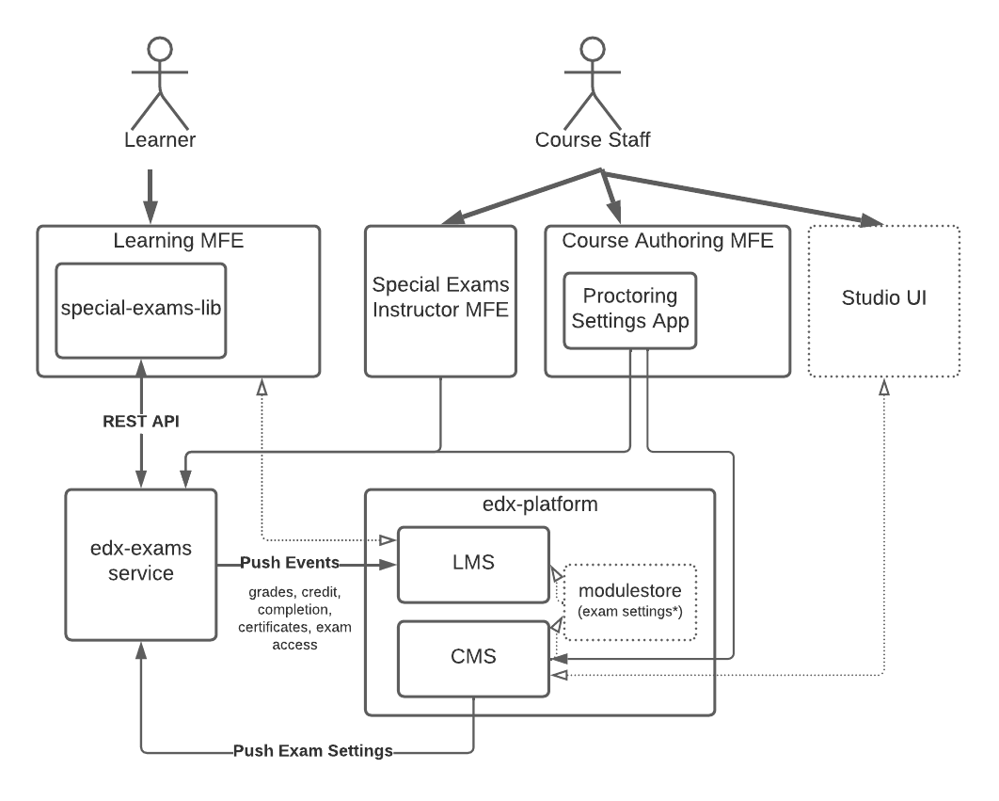
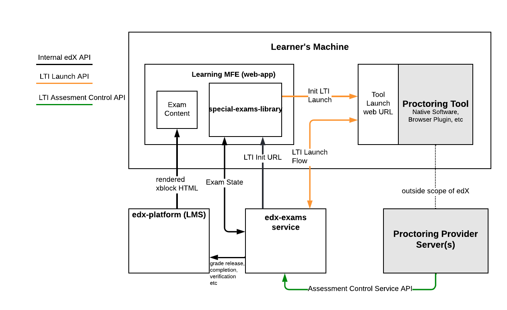
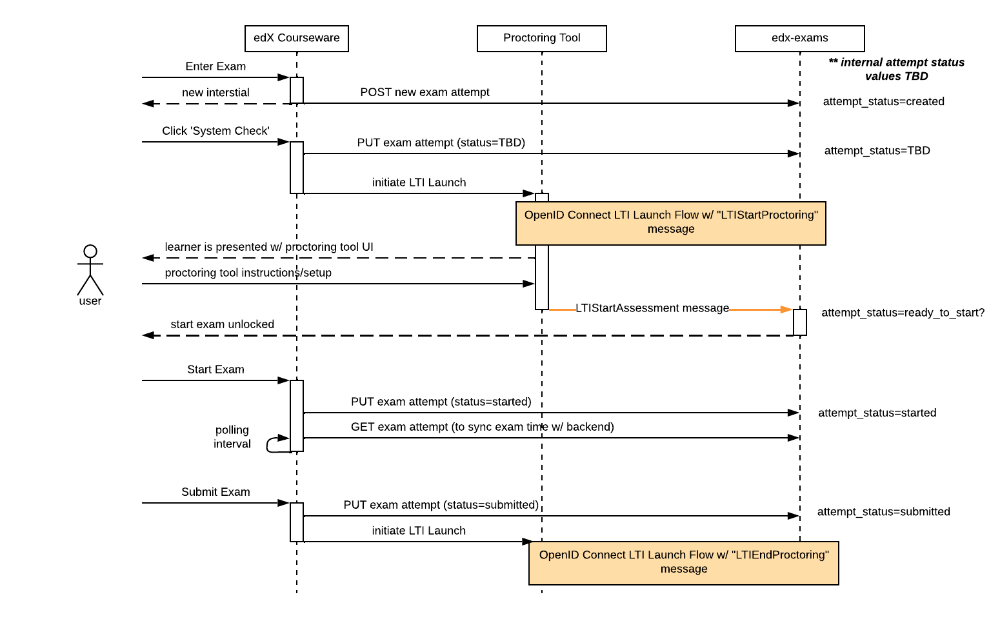

Exam System Overview
===========================
This document outlines the components involved in the edX exam system. It should
serve as a guide to orient developers on what components exist and how they interact.

.. contents::

System Components
-----------------

Interface with edX Systems
^^^^^^^^^^^^^^^^^^^^^^^^^^

Interface with Proctoring Tools
^^^^^^^^^^^^^^^^^^^^^^^^^^^^^^^

Learning MFE
^^^^^^^^^^^^
The user facing web application for edX courseware. This app handles fetching course content from
the LMS and rendering it within the course structure. For exam sections, the special-exams-lib injects
its own behavior into this rendering process.

special-exams-lib
^^^^^^^^^^^^^^^^^^^^^^^^^^^^^^

The special-exams React library is responsible for rendering different views and messaging
depending on the learner's exam attempt state. The goal of these views, or interstitials,
is to guide the learner through the many steps of setting up, attempting, and submitting
an exam. At many steps there are critical details about what the learner needs to do or understand.

If the learner is in the appropriate state this library will allow the learning MFE to
fetch and render the exam questions. In the case of proctored exams, the proctoring tool
must be successfully launched before exam content can be viewed.

https://github.com/edx/frontend-lib-special-exams/

edx-exams
^^^^^^^^^
This service handles all persistent proctoring and exam experience logic. It holds to models
for exam configuration, learner attempts, and proctoring providers. This service will also
act as an LTI consumer via the xblock-lti-consumer library building all LTI messages and
implementing the required callback URLs to complete the launch flow.

LTI Launch Flow
^^^^^^^^^^^^^^^
A series of handshakes that ensures the proctoring tool is launched and authenticated with the correct
context about the learner and the exam. For more details on the specifics of the launch flow see `LTI <./lti.rst>`_

Assessment Control Service API
^^^^^^^^^^^^^^^^^^^^^^^^^^^^^^
The Assessment Control Service (ACS) is a backend service API available to the proctoring provider update an
exam attempt during or after and exam. This API can be used to post review violations or terminate
a current exam session.

Exam States
-----------
When a learner first enters a proctored exam subsection an exam attempt is created
in the edX system. User actions and the proctoring tool will update the status of
this attempt as the exam is completed and reviewed. The following diagram describes the
flow through those status updates.

*supported states TBD*

Example Action Sequence
-------------------------

The diagrams below describes the happy-path of interactions between components to
sucessfully begin a proctored exam.

Specifics on LTI messages and launch flow can be found at `LTI <./lti.rst>`

Note: This is not final, design work is ongoing as the service is built.

